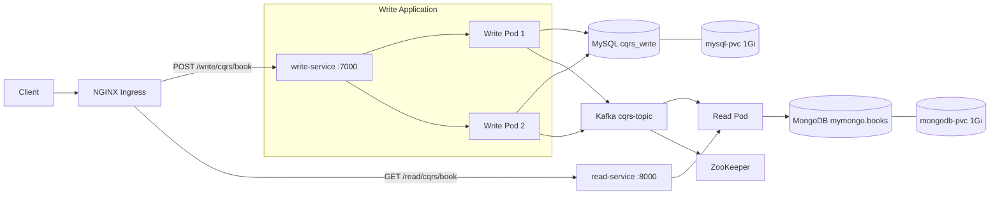

# Mini Project — Kubernetes CQRS 도서 서비스

도서 등록과 조회를 분리한 CQRS 학습 프로젝트입니다. Write Service가 MySQL에 도서를 저장하고 Kafka에 이벤트를 발행하면, Read Service가 이벤트를 받아 MongoDB에 조회 모델을 구성합니다.

최종 제출본에서는 두 애플리케이션과 MySQL, MongoDB, Kafka, ZooKeeper를 Kubernetes 리소스로 구성했습니다. Write Application은 2개의 Pod로 실행하도록 설정했으며, NGINX Ingress를 통해 Write/Read API에 접근하도록 구성했습니다.

## 구현 결과

| 영역 | 구현 내용 | 상태 |
|---|---|---|
| Write Service | 도서 등록, MySQL 저장, Kafka 이벤트 발행 | 완료 |
| Read Service | Kafka 이벤트 수신, MongoDB 저장, 도서 조회 | 완료 |
| 메시징 | Kafka와 ZooKeeper 구성 | 완료 |
| 컨테이너 | Write/Read 이미지 Docker Hub 업로드 | 완료 |
| Kubernetes | Deployment, Service, PVC 구성 | 완료 |
| 가용성 실습 | Write Application `replicas: 2` | 완료 |
| 외부 접근 | NGINX Ingress 경로 및 rewrite 구성 | 완료 |
| 영속 스토리지 | MySQL/MongoDB PVC 각 1Gi | 완료 |
| NFS | NFS 기반 PV 및 연결 | 미구현 |

## 아키텍처



## 서비스 구성

| 구성 요소 | Replicas | Service 포트 | 이미지/저장소 |
|---|---:|---:|---|
| Write Service | 2 | 7000 | `jiwon28/write-service:1.0` |
| Read Service | 1 | 8000 | `jiwon28/read-service:1.0` |
| MySQL | 1 | 3306 | `mysql:8.4`, `mysql-pvc` 1Gi |
| MongoDB | 1 | 27017 | `mongo:7.0`, `mongodb-pvc` 1Gi |
| Kafka | 1 | 9092 | `wurstmeister/kafka:latest` |
| ZooKeeper | 1 | 2181 | `wurstmeister/zookeeper:latest` |

## Docker 이미지

- Write Service: [jiwon28/write-service:1.0](https://hub.docker.com/r/jiwon28/write-service)
- Read Service: [jiwon28/read-service:1.0](https://hub.docker.com/r/jiwon28/read-service)

두 이미지는 Java 17 애플리케이션 JAR을 실행하며 UID/GID `10001:10001`의 비-root 사용자로 동작합니다.

## 데이터 처리 흐름

1. 클라이언트가 Write API로 도서 등록을 요청합니다.
2. Write Service가 도서를 MySQL `cqrs_write.book`에 저장합니다.
3. 저장된 도서의 `bid`를 포함한 이벤트를 Kafka `cqrs-topic`에 발행합니다.
4. Read Service가 이벤트를 소비하여 MongoDB `mymongo.books`에 저장합니다.
5. 클라이언트가 Read API를 호출하면 MongoDB의 조회 모델을 반환합니다.

Kafka 전달은 비동기이므로 Write API 응답 직후에는 새 도서가 Read API에 아직 보이지 않을 수 있습니다.

## API

### Kubernetes Ingress 경로

| 기능 | Method | 외부 경로 | 내부 전달 경로 |
|---|---|---|---|
| 도서 등록 | `POST` | `/write/cqrs/book` | Write Service `/cqrs/book` |
| 도서 조회 | `GET` | `/read/cqrs/book` | Read Service `/cqrs/book` |

Ingress는 `/write`와 `/read` 접두사를 제거한 뒤 각 서비스로 전달합니다.

### 등록 요청 예시

```http
POST /write/cqrs/book
Content-Type: application/json

{
  "title": "Kafka CQRS",
  "author": "Jiwon",
  "category": "IT",
  "pages": 450,
  "price": 32000,
  "published_date": "2026-09-09",
  "description": "Kafka CQRS Test Book"
}
```

성공 응답은 HTTP 200과 `success`입니다.

## Kubernetes 제출 구성

최종 제출한 `k8s-yaml.zip`에는 다음 리소스가 포함되어 있습니다.

- Write/Read Deployment 및 ClusterIP Service
- MySQL/MongoDB Deployment, ClusterIP Service 및 PVC
- Kafka/ZooKeeper Deployment 및 ClusterIP Service
- Write/Read 경로를 제공하는 NGINX Ingress

애플리케이션 연결 정보는 다음 환경 변수로 전달합니다.

| 대상 | 환경 변수 | Kubernetes 주소 |
|---|---|---|
| Write → MySQL | `DB_URL` | `jdbc:mysql://mysql-service:3306/cqrs_write` |
| Write → Kafka | `KAFKA_BOOTSTRAP_SERVERS` | `kafka-service:9092` |
| Read → MongoDB | `MONGODB_URI` | `mongodb://mongodb-service:27017/mymongo` |
| Read → Kafka | `KAFKA_BOOTSTRAP_SERVERS` | `kafka-service:9092` |

PVC는 클러스터의 기본 StorageClass를 사용합니다. 별도의 NFS PersistentVolume, NFS 서버 주소 및 경로는 최종 제출본에 포함하지 않았습니다.

## 검증 기록

로컬 환경에서 다음 흐름을 수동으로 확인했습니다.

```text
POST 등록 → MySQL 저장 → Kafka 발행/수신 → MongoDB 저장 → GET 조회
```

- Write/Read 로그에서 동일한 `bid: 202` 확인
- MongoDB 조회 결과가 3건에서 4건으로 증가
- GET 응답에서 등록한 도서의 `bid`, `pages`, `price` 확인
- Write/Read 서비스의 실행 JAR과 Docker 이미지 생성
- Kubernetes 배포용 YAML 및 Ingress 경로 구성

Kubernetes 리소스의 실제 실행 로그와 `kubectl get` 결과는 저장소에 보관되어 있지 않습니다.

## 기술 스택

- Java 17
- Spring Boot 4.1.1
- Spring Web MVC
- Spring Data JPA / MySQL
- Spring Data MongoDB / MongoDB
- Spring for Apache Kafka
- Gradle
- Docker / Docker Hub
- Kubernetes / NGINX Ingress

## 알려진 제한 사항과 후속 개선

- NFS 기반 PV를 구성하지 않았습니다.
- 제출 YAML의 MySQL 비밀번호가 평문이므로 Kubernetes Secret으로 분리해야 합니다.
- 자동화된 API·Kafka 통합 테스트가 없습니다.
- Kafka 메시지 재수신 시 `bid` 기준 중복 방지와 upsert가 필요합니다.
- Producer의 JSON 직접 조합을 표준 직렬화 방식으로 교체해야 합니다.
- 재시도, DLQ, Outbox 등 실패 처리와 데이터 정합성 보강이 필요합니다.
- readiness/liveness probe와 리소스 requests/limits가 없습니다.
- Kafka와 ZooKeeper 이미지의 `latest` 태그를 고정 버전으로 교체하는 것이 좋습니다.

## 소스와 제출 이미지

최종 제출한 `read-service:1.0` 이미지에는 `MONGODB_URI`, `KAFKA_BOOTSTRAP_SERVERS` 외부 설정과 `MongoTemplate` 기반 Kafka Consumer가 포함되어 있습니다. Docker 이미지 생성 이후의 소스 변경이 Git 저장소에 모두 반영되지 않아, 현재 저장소 소스와 제출 이미지 사이에는 일부 차이가 있습니다.
