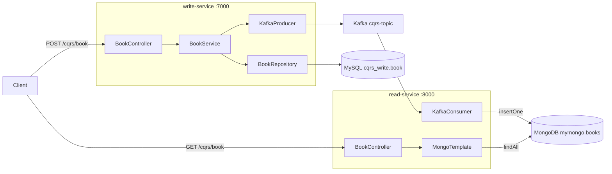

# Mini Project — CQRS 도서 서비스

도서 등록과 조회를 별도 애플리케이션과 데이터 저장소로 분리하는 CQRS 학습 프로젝트입니다. Write Service가 MySQL에 책을 저장하고 Kafka에 메시지를 발행하면, Read Service가 이를 받아 MongoDB에 저장합니다. 등록부터 GET 조회까지 수동 통합 검증을 완료했습니다.

## 현재 아키텍처



| 구분 | write-service | read-service |
|---|---|---|
| 역할 | 도서 등록 및 Kafka 발행 | Kafka 수신·MongoDB 저장 및 조회 |
| 포트 | `7000` | `8000` |
| 저장소 | MySQL `cqrs_write.book` | MongoDB `mymongo.books` |
| 데이터 접근 | Spring Data JPA | 수신: MongoDB Driver / 조회: MongoTemplate |
| API | `POST /cqrs/book` | `GET /cqrs/book` |

Kafka 메시지는 MySQL이 직접 보내는 것이 아니라 `BookService`가 `save()` 호출 후 발행합니다. MongoDB 반영은 비동기이므로 POST 응답 직후 GET에는 잠시 새 책이 보이지 않을 수 있습니다.

## 구현 흐름

### 도서 등록과 발행

1. `BookController`가 요청을 `BookDTO`로 받습니다.
2. `BookService`가 출판일 문자열을 변환하고 `Book` 엔티티를 구성합니다.
3. `BookRepository.save()` 반환값의 `bid`를 DTO에 설정합니다.
4. `KafkaProducer`가 도서 정보를 JSON 문자열로 조합해 `cqrs-topic`에 발행 요청합니다.

```java
Book savedBook = bookRepository.save(book);
bookDTO.setBid(savedBook.getBid());
kafkaProducer.sendMessage(bookDTO);
```

`BookService`는 `@Transactional`을 사용합니다. Kafka 발행 요청은 DB 커밋 전에 실행되며, 두 작업의 원자성은 보장하지 않습니다.

### 메시지 수신과 저장

`KafkaConsumer`는 `@KafkaListener(topics = "cqrs-topic", groupId = "adamsoft")`로 메시지를 수신합니다.

```text
Kafka 문자열 → JSONObject → Document → mymongo.books.insertOne()
```

- `bid`, `pages`, `price`는 Producer에서 문자열로 보내고 Consumer에서 숫자로 변환합니다.
- Consumer는 강의 예제대로 메시지마다 `MongoClient`를 직접 생성합니다. try-with-resources로 예외가 발생해도 닫습니다.
- Consumer의 MongoDB 주소와 DB 이름은 코드에 지정되어 있습니다.
- `auto-offset-reset: earliest`는 유효한 커밋 오프셋이 없을 때 적용됩니다. 같은 그룹을 재시작할 때마다 처음부터 읽는 설정은 아닙니다.

### 도서 조회

`GET /cqrs/book`은 Spring이 관리하는 `MongoTemplate`으로 `books` 컬렉션을 조회합니다. 조회 API의 연결 설정은 `application.yaml`의 `spring.mongodb.uri`이며, Consumer와 동일한 `mymongo`를 사용합니다.

## 프로젝트 구성

```text
mini_project/
├─ README.md
├─ build.gradle
├─ settings.gradle
├─ docker-compose.yml
├─ write-service/
│  ├─ build.gradle
│  └─ src/main/
│     ├─ java/com/example/writeservice/
│     │  ├─ Book.java
│     │  ├─ BookDTO.java
│     │  ├─ BookRepository.java
│     │  ├─ BookController.java
│     │  ├─ BookService.java
│     │  ├─ KafkaProducer.java
│     │  └─ WriteServiceApplication.java
│     └─ resources/application.yaml
└─ read-service/
   ├─ build.gradle
   └─ src/main/
      ├─ java/com/example/readservice/
      │  ├─ BookController.java
      │  ├─ KafkaConsumer.java
      │  └─ ReadServiceApplication.java
      └─ resources/application.yaml
```

기술 스택: Java 17, Spring Boot 4.1.1, Gradle Wrapper 9.7.1, Spring Web MVC, Spring Data JPA, MySQL, Spring Data MongoDB, Spring for Apache Kafka, `org.json:json:20190722`, Lombok.

두 서비스는 `spring-boot-starter-kafka`를 사용합니다. 각 서비스는 독립적으로 실행할 수 있고, 루트 `settings.gradle`에도 하위 프로젝트로 등록되어 있습니다.

## 실행 준비

| 구성 요소 | 로컬 연결 정보 | 용도 |
|---|---|---|
| MySQL | `localhost:3307/cqrs_write` | 쓰기 모델 저장 |
| MongoDB | `localhost:27017/mymongo` | 읽기 모델 저장·조회 |
| Kafka | `localhost:9092` | `cqrs-topic` 메시지 전달 |
| ZooKeeper | `localhost:2181` | 현재 Kafka 구성에서 사용 |

현재 Compose 파일은 Kafka와 ZooKeeper만 실행합니다. MySQL과 MongoDB는 별도로 준비해야 합니다. 아래 명령은 저장소 루트의 PowerShell에서 실행합니다.

### 1. Kafka와 ZooKeeper 실행

```powershell
docker compose up -d zookeeper kafka
docker ps
docker exec kafka /opt/kafka/bin/kafka-topics.sh --bootstrap-server localhost:9092 --list
```

`kafka`, `zookeeper`가 실행 중이고 `cqrs-topic`이 조회되는지 확인합니다. 현재 실습 환경에는 해당 토픽이 이미 존재합니다. Kafka가 종료되어 있다면 `docker logs --tail 100 kafka`로 원인을 먼저 확인합니다.

### 2. Write Service 실행

MySQL 비밀번호는 실행 터미널 또는 IntelliJ 실행 구성의 `DB_PASSWORD` 환경 변수로 전달합니다.

```powershell
$env:DB_PASSWORD = "your-password"
.\gradlew.bat :write-service:bootRun
```

### 3. Read Service 실행

별도 터미널에서 실행합니다.

```powershell
.\gradlew.bat :read-service:bootRun
```

각 콘솔에서 `Tomcat started on port 7000`, `Tomcat started on port 8000`을 확인합니다. 각 서비스 폴더에서 ` .\gradlew.bat bootRun`으로 독립 실행할 수도 있습니다.

IntelliJ에서는 루트 `build.gradle`을 Gradle 프로젝트로 연결하고 Gradle 도구 창에서 동기화합니다. Gradle JVM은 JDK 17을 사용합니다.

### Write Service Docker 이미지 빌드

Dockerfile은 로컬에서 생성한 실행 JAR을 이미지에 복사합니다. 소스 변경 후에는 반드시 `bootJar`를 다시 실행합니다. 저장소 루트에서:

```powershell
.\gradlew.bat :write-service:bootJar
docker build -t cqrs-write:local ./write-service
```

빌드 컨텍스트는 `write-service`입니다. JAR 버전이 바뀌면 `--build-arg JAR_FILE=build/libs/<실행 JAR 이름>`을 지정할 수 있습니다. 이미지는 UID/GID `10001:10001`로 실행하며, `.dockerignore`는 JAR 외의 소스·로컬 설정 등을 빌드 컨텍스트에서 제외합니다.

컨테이너 실행 시 다음 값을 환경 변수로 전달해야 합니다.

| 환경 변수 | 설정 기준 |
|---|---|
| `DB_PASSWORD` | MySQL 접속 비밀번호 |
| `SPRING_DATASOURCE_URL` | 컨테이너에서 접근 가능한 MySQL 주소. Docker Desktop의 호스트 MySQL은 `jdbc:mysql://host.docker.internal:3307/cqrs_write` |
| `SPRING_KAFKA_BOOTSTRAP_SERVERS` | 컨테이너에서 접근 가능한 Kafka 브로커 주소 |

현재 Compose의 Kafka는 클라이언트에 `127.0.0.1`을 광고하므로, 호스트에서 실행하는 Spring 앱을 기준으로 구성되어 있습니다. Write Service를 컨테이너에서 실행하려면 Kafka의 advertised listener도 컨테이너에서 접근 가능한 주소로 구성해야 합니다. Bootstrap 주소만 바꾸는 것으로는 충분하지 않습니다. Kafka 네트워크 구성 변경 및 컨테이너 전체 송수신 검증은 별도 작업입니다.

`EXPOSE 7000`은 포트를 호스트에 연결하지 않습니다. 실행 시 `-p 7000:7000`을 지정하고, 기존 로컬 Write Service와 포트가 겹치지 않도록 합니다.

### Read Service Docker 이미지 빌드

저장소 루트에서 최신 실행 JAR을 생성한 뒤, `read-service`를 빌드 컨텍스트로 지정합니다.

```powershell
.\gradlew.bat :read-service:bootJar
docker build -t cqrs-read:local ./read-service
```

Write Service와 동일하게 `JAR_FILE` 빌드 인자를 지원하고 UID/GID `10001:10001`로 실행합니다. HTTP 포트를 호스트에 연결하려면 `-p 8000:8000`이 필요합니다.

컨테이너에서 조회 API의 MongoDB 주소는 `SPRING_MONGODB_URI`로 지정할 수 있습니다. 그러나 현재 `KafkaConsumer`는 코드에 `mongodb://localhost:27017`과 `mymongo`를 직접 지정하므로 이 환경 변수를 따르지 않습니다. 컨테이너에서 수신 후 저장까지 수행하려면 Consumer의 연결 설정도 외부 설정과 통일해야 합니다. Kafka 역시 컨테이너에서 접근 가능한 bootstrap 및 advertised listener 주소가 필요합니다.

이미지 빌드 검증과 Kafka → MongoDB 전체 컨테이너 통합 검증은 별개입니다. 기존 수동 통합 검증은 두 Spring 앱을 호스트에서 실행한 결과입니다.

## API 실습

### 등록

Postman에서 Body를 raw / JSON으로 설정합니다.

```http
POST http://localhost:7000/cqrs/book
Content-Type: application/json

{
  "title": "Kafka CQRS",
  "author": "Jiwon",
  "category": "IT",
  "pages": 450,
  "price": 32000,
  "published_date": "2026-09-09",
  "description": "Kafka CQRS Test Book"
}
```

출판일은 `yyyy-MM-dd` 형식으로 전달합니다. 성공 응답은 HTTP 200과 `success`이며, 이 응답 자체가 MongoDB 반영 완료를 의미하지는 않습니다.

### 조회 및 저장 대조

```http
GET http://localhost:8000/cqrs/book
```

1. Write 로그의 `Kafka Send`와 Read 로그의 `Kafka Received`에서 같은 `bid`를 확인합니다.
2. MongoDB Compass의 `mymongo.books`를 새로고침하고 해당 `bid`의 문서를 확인합니다.
3. GET 응답에 같은 책이 포함되는지 확인합니다.
4. MySQL의 `cqrs_write.book`에서도 같은 `bid`를 조회해 대조합니다.

필요하면 별도 터미널에서 Kafka 메시지를 직접 확인합니다.

```powershell
docker exec -it kafka /opt/kafka/bin/kafka-console-consumer.sh --bootstrap-server localhost:9092 --topic cqrs-topic --from-beginning
```

## 진행 및 검증 기록

| 날짜 | 완료한 작업과 검증 |
|---|---|
| 2026-09-08 | 서비스 분리, MySQL 등록, MongoTemplate 조회 구현. 루트 `clean build`와 두 서비스 컨텍스트 테스트 성공 |
| 2026-09-09 | Producer 연결 및 컴파일 성공. `bid: 152` Kafka 수신 확인, 사용자 MySQL 대조 완료 |
| 2026-09-09 | Consumer 구현 및 컴파일 성공. POST → Kafka → MongoDB → GET 수동 통합 검증 완료 |

최종 통합 검증은 Postman 대신 PowerShell HTTP 요청으로 수행했습니다.

- `Kafka CQRS` / `Jiwon` 등록: HTTP 200, `success`.
- Write 발행과 Read 수신 로그에서 동일한 `bid: 202` 확인.
- MongoDB를 조회하는 GET 결과가 3건에서 4건으로 증가.
- GET 응답에서 `bid: 202`, `pages: 450`, `price: 32000`인 새 문서 확인.

검증 중 조회 API가 기본 DB `test`를 사용하는 문제를 디버거 logpoint로 확인했습니다. MongoDB 설정 키를 `spring.data.mongodb.uri`에서 Boot 4의 `spring.mongodb.uri`로 변경해 해결했습니다.

초기 콘솔 테스트 문자열 `hello kafka`는 JSON 파싱 오류를 발생시켰고 이후 정상 도서 메시지 소비는 이어졌습니다. `Kafka Send`는 발행 요청 로그이며, `Kafka Received`는 수신 로그입니다. 저장 성공은 MongoDB 문서 또는 GET 결과로 확인해야 합니다.

기존 `clean build` 성공은 Consumer 추가 전의 기록입니다. 현재 전체 흐름의 검증은 수동 테스트이며, 자동화된 API·이벤트 통합 테스트는 아직 없습니다.

## 남은 개선 작업

1. Consumer에 `MongoTemplate`을 주입해 연결 관리와 설정을 조회 API와 통일합니다.
2. `bid` 기준 고유성 및 upsert를 적용해 메시지 재수신 시 중복 문서 생성을 방지합니다. 현재 `insertOne()`은 재수신마다 새 문서를 추가합니다.
3. Producer의 JSON 직접 조합을 직렬화 방식으로 교체합니다. 현재 입력값의 따옴표·역슬래시·줄바꿈을 이스케이프하지 않습니다.
4. 비동기 발행 결과 확인, 잘못된 메시지 처리, 재시도 및 DLQ 정책을 추가합니다.
5. Outbox와 별도 발행 처리 등을 도입해 DB 커밋과 이벤트 발행의 불일치에 대응합니다.
6. 입력 검증과 자동화 통합 테스트를 보강합니다.

현재 Kafka 연결과 MongoDB 반영은 구현되어 있습니다. 위 항목은 중복·실패 상황에서도 데이터 일관성을 유지하기 위한 후속 작업입니다.
