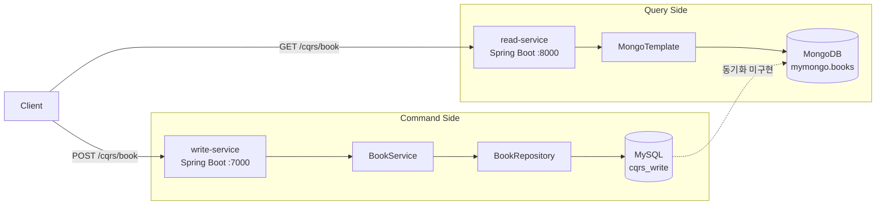
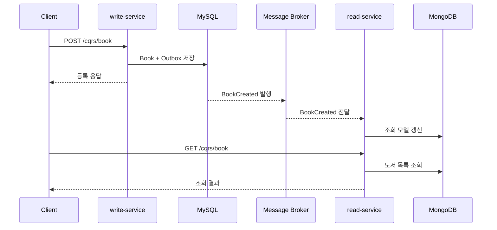

# Mini Project — CQRS 도서 서비스

도서 등록과 조회의 책임을 서로 다른 애플리케이션과 데이터 저장소로 분리하며 CQRS(Command Query Responsibility Segregation)를 학습하는 프로젝트입니다.

현재는 쓰기 모델과 읽기 모델의 기본 구조를 각각 구현한 단계입니다. 쓰기 데이터가 읽기 저장소로 자동 반영되는 동기화 파이프라인은 아직 구현되지 않았으므로, 이 저장소는 **완성된 CQRS 시스템이 아니라 CQRS 아키텍처로 발전 중인 프로젝트**입니다.

## 현재 아키텍처



| 구분 | write-service | read-service |
|---|---|---|
| 역할 | 명령 처리 및 도서 등록 | 조회 처리 및 도서 목록 반환 |
| 포트 | `7000` | `8000` |
| 저장소 | MySQL `cqrs_write` | MongoDB `mymongo` |
| 접근 기술 | Spring Data JPA | Spring Data MongoDB `MongoTemplate` |
| API | `POST /cqrs/book` | `GET /cqrs/book` |

두 서비스는 같은 `/cqrs/book` 경로를 사용하지만 HTTP 메서드와 실행 포트가 다릅니다. 각 서비스는 독립된 Gradle 프로젝트이며 별도로 실행할 수 있습니다.

## 프로젝트 진행 과정

### 1. 명령과 조회 애플리케이션 분리

첫 단계에서는 하나의 애플리케이션이 모든 요청을 처리하는 대신 다음 두 프로젝트로 책임을 나눴습니다.

- `write-service`: 시스템 상태를 변경하는 명령 담당
- `read-service`: 저장된 데이터를 반환하는 조회 담당

이 분리를 통해 쓰기와 읽기를 서로 다른 모델, 저장 기술, 확장 전략으로 발전시킬 수 있는 기반을 만들었습니다.

### 2. 쓰기 모델 계층화

`write-service`는 일반적인 계층형 구조로 도서 등록 흐름을 구현했습니다.

```text
HTTP 요청
  → BookController
  → BookService
  → BookRepository
  → MySQL
```

- `BookDTO`가 외부 요청 데이터를 받습니다.
- `BookService`가 출판일 문자열을 검증하고 `Book` 엔티티로 변환합니다.
- `BookRepository`가 JPA를 이용해 MySQL에 저장합니다.
- 저장 로직은 `@Transactional` 경계 안에서 실행됩니다.
- 데이터베이스 비밀번호는 코드에 직접 저장하지 않고 `DB_PASSWORD` 환경 변수로 받습니다.

이 단계에서 HTTP 요청 모델과 영속성 엔티티를 분리하고, 컨트롤러가 데이터 접근을 직접 수행하지 않도록 역할을 구분했습니다.

### 3. 읽기 모델과 MongoDB 도입

`read-service`는 조회에 사용할 별도의 MongoDB 데이터베이스와 `books` 컬렉션을 사용합니다.

초기 구현에서는 컨트롤러가 요청마다 다음 작업을 직접 수행했습니다.

1. 하드코딩된 주소로 `MongoClient` 생성
2. 데이터베이스와 컬렉션 직접 선택
3. 조회 결과를 목록으로 변환
4. 클라이언트 직접 종료

이 방식은 컨트롤러가 연결 수명 주기와 설정까지 책임하며, 조회 중 예외가 발생하면 연결 정리가 누락될 여지가 있었습니다.

### 4. 읽기 모델의 연결 관리 개선

현재 `BookController`는 Spring이 관리하는 `MongoTemplate`을 생성자로 주입받도록 변경했습니다.

```text
GET /cqrs/book
  → BookController
  → MongoTemplate.findAll(...)
  → MongoDB의 books 컬렉션
```

이 변경으로 다음 사항이 개선되었습니다.

- 요청마다 MongoDB 클라이언트를 생성하고 종료하지 않습니다.
- 연결 정보는 `application.yaml`의 `spring.data.mongodb.uri` 한 곳에서 관리합니다.
- 컨트롤러는 HTTP 요청 처리와 결과 반환에 집중합니다.
- 연결 수명 주기는 Spring 컨테이너가 관리합니다.

### 5. 현재 아키텍처의 경계

쓰기 서비스는 MySQL에 저장하고 읽기 서비스는 MongoDB에서 조회하지만, 현재 코드에는 MySQL의 변경 사항을 MongoDB로 전달하는 구성 요소가 없습니다.

따라서 지금 단계에서는 다음 동작이 자동으로 이어지지 않습니다.

```text
POST 요청 → MySQL 저장 → MongoDB 반영 → GET 결과 노출
                         ↑
                   현재 미구현 구간
```

MongoDB에 도서 문서가 별도로 준비되어 있지 않으면 조회 API는 빈 목록을 반환합니다. 이 제약을 명확히 인식하는 것이 다음 단계의 핵심입니다.

## 디렉터리 구조

```text
mini_project/
├─ README.md
├─ write-service/
│  ├─ build.gradle
│  └─ src/
│     ├─ main/java/com/example/writeservice/
│     │  ├─ Book.java
│     │  ├─ BookController.java
│     │  ├─ BookDTO.java
│     │  ├─ BookRepository.java
│     │  ├─ BookService.java
│     │  └─ WriteServiceApplication.java
│     └─ main/resources/application.yaml
└─ read-service/
   ├─ build.gradle
   └─ src/
      ├─ main/java/com/example/readservice/
      │  ├─ BookController.java
      │  └─ ReadServiceApplication.java
      └─ main/resources/application.yaml
```

## 기술 스택

- Java 17
- Spring Boot 4.1.1
- Gradle Wrapper 9.7.1
- Spring Web MVC
- Spring Data JPA / Hibernate
- MySQL
- Spring Data MongoDB
- Lombok

## 실행 준비

로컬 환경에 다음 데이터베이스가 필요합니다.

| 데이터베이스 | 연결 정보 | 용도 |
|---|---|---|
| MySQL | `localhost:3307/cqrs_write` | 쓰기 모델 저장 |
| MongoDB | `localhost:27017/mymongo` | 읽기 모델 조회 |

MySQL 접속 비밀번호는 `DB_PASSWORD` 환경 변수로 설정합니다.

PowerShell 예시:

```powershell
$env:DB_PASSWORD = "your-password"
```

### write-service 실행

```powershell
cd write-service
.\gradlew.bat bootRun
```

### read-service 실행

별도 터미널에서 실행합니다.

```powershell
cd read-service
.\gradlew.bat bootRun
```

## API 예시

### 도서 등록

요청은 `write-service`로 전달되며 MySQL에 저장됩니다.

```http
POST http://localhost:7000/cqrs/book
Content-Type: application/json

{
  "title": "도메인 주도 설계",
  "author": "Eric Evans",
  "category": "Software",
  "pages": 560,
  "price": 38000,
  "published_date": "2026-09-06",
  "description": "도메인 모델링과 설계에 관한 도서"
}
```

`published_date`는 `yyyy-MM-dd` 형식이어야 합니다.

### 도서 목록 조회

요청은 `read-service`로 전달되며 MongoDB의 `mymongo.books` 컬렉션을 조회합니다.

```http
GET http://localhost:8000/cqrs/book
```

현재는 저장소 동기화가 없으므로 위의 등록 API로 MySQL에 저장한 데이터가 조회 API에 자동으로 나타나지는 않습니다.

## 다음 아키텍처 단계

우선순위가 높은 발전 방향은 쓰기 모델의 변경을 읽기 모델로 안전하게 전달하는 것입니다.

1. `BookCreated`와 같은 도메인 이벤트 정의
2. 쓰기 트랜잭션과 이벤트 발행의 불일치를 방지하기 위한 Outbox 패턴 적용
3. Kafka 또는 RabbitMQ 등의 메시지 브로커 연결
4. 읽기 서비스의 이벤트 소비자 및 MongoDB projection 구현
5. 중복 이벤트에도 안전한 멱등성 처리와 재시도 정책 추가
6. 실패 이벤트를 위한 DLQ와 관측성 구성
7. API 입력 검증, 예외 응답 형식, 서비스 단위·통합 테스트 보강

목표 흐름은 다음과 같습니다.



이 구조가 구현되면 명령 처리와 조회 처리를 독립적으로 확장하면서도, 최종적 일관성(eventual consistency)을 통해 두 저장소의 상태를 연결할 수 있습니다.

## 루트 프로젝트 빌드 및 IntelliJ 설정

저장소 루트의 `settings.gradle`이 `write-service`와 `read-service`를 Gradle 하위 프로젝트로 등록합니다. 각 서비스 디렉터리에서 기존처럼 독립적으로 빌드하거나 실행할 수도 있습니다.

IntelliJ에서 루트 폴더만 일반 Java 프로젝트로 열면 서비스 소스와 Spring 의존성이 인식되지 않을 수 있습니다. Project 창에서 루트 `build.gradle`을 우클릭하여 **Import Gradle Project**로 연결하고 Gradle 동기화를 완료하세요. 이미 연결되어 해당 메뉴가 없다면 Gradle 도구 창에서 **Sync All Gradle Projects**를 실행하세요. Gradle JVM은 JDK 17을 사용합니다.

저장소 루트에서 실행:

```powershell
.\gradlew.bat build
.\gradlew.bat :write-service:bootRun
```

`bootRun` 및 쓰기 서비스의 컨텍스트 테스트에는 위에서 설명한 MySQL과 `DB_PASSWORD` 설정이 필요합니다.

## 현재 검증 상태

- `read-service`: Gradle 테스트 및 Spring 애플리케이션 컨텍스트 로딩 성공
- `write-service`: Gradle 테스트 및 MySQL 연결을 포함한 Spring 애플리케이션 컨텍스트 로딩 성공
- 루트 `clean build`: 두 서비스의 컴파일, 테스트 및 실행 JAR 생성 성공 (2026-09-08)
- API 및 이벤트 기반 동기화에 대한 통합 테스트는 아직 없음
