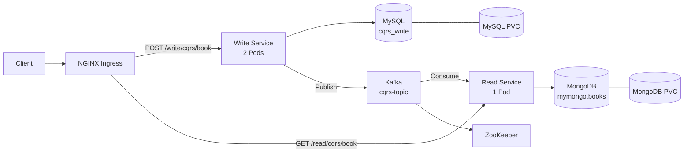

# CQRS Book Service

MySQL 기반의 Write 모델과 MongoDB 기반의 Read 모델을 분리하고, Apache Kafka를 통해 데이터를 비동기 동기화한 개인 프로젝트입니다.

Spring Boot로 Write/Read 서비스를 각각 구현했으며, Docker 이미지로 패키징한 뒤 Kubernetes 환경에서 Deployment, Service, PVC와 NGINX Ingress를 구성했습니다.

## Project Overview

- **진행 기간:** 2026.09.03 ~ 2026.09.17
- **프로젝트 유형:** 개인 프로젝트
- **핵심 목표:** CQRS 패턴과 이벤트 기반 데이터 동기화 이해
- **배포 목표:** 컨테이너화한 서비스를 Kubernetes에서 분리 배포하고 Ingress로 노출

## System Architecture



### Architecture Point

- **Command / Query 분리:** 도서 등록은 Write Service, 조회는 Read Service가 담당합니다.
- **Database 분리:** 쓰기 모델은 MySQL, 조회 모델은 MongoDB에 저장합니다.
- **Event-Driven 동기화:** Write Service가 발행한 도서 이벤트를 Read Service가 Kafka로 수신합니다.
- **독립적 확장:** Write Application은 Kubernetes에서 2개의 Pod로 구성했습니다.
- **단일 진입점:** NGINX Ingress가 `/write`, `/read` 요청을 각 서비스로 전달합니다.

## Tech Stack

| Category | Technology |
|---|---|
| Language | Java 17 |
| Framework | Spring Boot 4.1.1, Spring Web MVC |
| Write Database | MySQL 8.4, Spring Data JPA |
| Read Database | MongoDB 7.0, Spring Data MongoDB |
| Message Broker | Apache Kafka, ZooKeeper |
| Build | Gradle |
| Container | Docker, Docker Hub |
| Orchestration | Kubernetes, NGINX Ingress |

## Key Features

### 1. Write Service

- `POST /cqrs/book`으로 도서 등록 요청을 처리합니다.
- 도서 데이터를 MySQL의 `cqrs_write.book` 테이블에 저장합니다.
- 데이터베이스에서 생성한 `bid`를 포함해 Kafka `cqrs-topic`으로 이벤트를 발행합니다.

### 2. Read Service

- Kafka에서 도서 생성 이벤트를 비동기적으로 수신합니다.
- 수신한 이벤트를 MongoDB의 `mymongo.books` 컬렉션에 저장합니다.
- `GET /cqrs/book`으로 MongoDB의 조회 모델을 반환합니다.

### 3. Kubernetes Deployment

- Write Service는 `replicas: 2`, Read Service는 `replicas: 1`로 구성했습니다.
- MySQL과 MongoDB에는 각각 1Gi PVC를 연결했습니다.
- Kafka와 ZooKeeper를 클러스터 내부 서비스로 구성했습니다.
- 애플리케이션과 데이터베이스는 Kubernetes Service 이름으로 통신합니다.

### 4. NGINX Ingress

Ingress는 외부 경로의 접두사를 제거한 뒤 각 애플리케이션으로 전달합니다.

| Method | External Path | Target Service | Internal Path |
|---|---|---|---|
| `POST` | `/write/cqrs/book` | Write Service | `/cqrs/book` |
| `GET` | `/read/cqrs/book` | Read Service | `/cqrs/book` |

## Data Flow

```text
Client
  └─ POST /write/cqrs/book
       └─ Write Service
            ├─ MySQL 저장
            └─ Kafka 이벤트 발행
                 └─ Read Service 이벤트 수신
                      └─ MongoDB 저장
                           └─ GET /read/cqrs/book
```

Kafka를 통한 데이터 전달은 비동기 방식이므로, 등록 요청 직후에는 Read API에 새 데이터가 아직 반영되지 않았을 수 있습니다.

## API Example

```http
POST /write/cqrs/book
Content-Type: application/json

{
  "title": "Kafka CQRS",
  "author": "Jiwon",
  "category": "IT",
  "pages": 450,
  "price": 32000,
  "published_date": "2026-09-09",
  "description": "Kafka CQRS Test Book"
}
```

성공 시 HTTP 200과 `success`를 반환합니다.

## Docker Images

- [jiwon28/write-service:1.0](https://hub.docker.com/r/jiwon28/write-service)
- [jiwon28/read-service:1.0](https://hub.docker.com/r/jiwon28/read-service)

| Service | Environment Variable | Kubernetes Address |
|---|---|---|
| Write → MySQL | `DB_URL` | `jdbc:mysql://mysql-service:3306/cqrs_write` |
| Write → Kafka | `KAFKA_BOOTSTRAP_SERVERS` | `kafka-service:9092` |
| Read → MongoDB | `MONGODB_URI` | `mongodb://mongodb-service:27017/mymongo` |
| Read → Kafka | `KAFKA_BOOTSTRAP_SERVERS` | `kafka-service:9092` |

## Kubernetes Resources

최종 제출본은 다음 리소스로 구성했습니다.

```text
Ingress
├─ Write Deployment / Service (2 Pods)
├─ Read Deployment / Service (1 Pod)
├─ MySQL Deployment / Service / PVC
├─ MongoDB Deployment / Service / PVC
├─ Kafka Deployment / Service
└─ ZooKeeper Deployment / Service
```

## Verification

로컬 환경에서 다음 흐름을 수동으로 검증했습니다.

```text
POST 등록 → MySQL 저장 → Kafka 발행/수신 → MongoDB 저장 → GET 조회
```

- Write/Read 로그에서 동일한 `bid` 확인
- MongoDB 문서 증가 확인
- GET 응답에서 등록한 도서 데이터 확인
- Docker 이미지 생성 및 Docker Hub 업로드
- Kubernetes Deployment, Service, PVC, Ingress YAML 작성

## Notes

- PVC는 클러스터의 기본 StorageClass를 사용하며, NFS 기반 PersistentVolume은 구성하지 않았습니다.
- Kubernetes 실행 당시의 `kubectl get` 및 Pod 로그는 저장소에 남아 있지 않습니다.
- 최종 제출한 `read-service:1.0` 이미지에는 외부 연결 설정과 `MongoTemplate` 기반 Consumer가 반영되어 있으나, 해당 변경 일부는 Git 저장소에 동기화되지 않았습니다.

## Future Improvements

- NFS 기반 PersistentVolume 구성
- Kubernetes Secret을 이용한 데이터베이스 비밀번호 관리
- Kafka 메시지 중복 처리와 MongoDB upsert 적용
- 재시도, DLQ, Outbox 패턴을 통한 장애 대응
- API 및 이벤트 흐름 통합 테스트 자동화
- readiness/liveness probe와 리소스 requests/limits 추가
